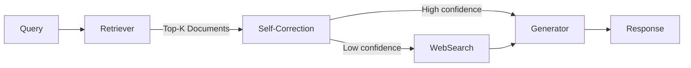

# Mastering Corrective Retrieval-Augmented Generation (Corrective RAG): Techniques and Implementation

## Introduction to Retrieval-Augmented Generation (RAG) and Need for Correction

Retrieval-Augmented Generation (RAG) is an advanced approach that integrates retrieval mechanisms with language models to improve the quality, accuracy, and contextual relevance of generated text. Instead of relying purely on pre-trained neural networks, RAG systems query external knowledge bases or document stores during inference to fetch relevant snippets of information, which are then used as evidence for generating responses. This hybrid workflow typically involves two main stages: (1) **retrieval**, where pertinent documents or passages are selected based on the input query, and (2) **generation**, where the language model conditions its output on both the query and the retrieved content to produce more informed and context-aware text. This paradigm is especially valuable for tasks requiring up-to-date or domain-specific knowledge that static models may lack.

Despite its promise, traditional RAG systems face several challenges that can undermine output quality. One common issue is **hallucination**, where the model generates plausible but factually incorrect content that is not supported by retrieved evidence. Additionally, **retrieval failures** occur when the system either returns irrelevant documents or misses critical information, leading to incomplete or misleading responses. These errors stem from limitations in the retrieval components, noisy or sparse knowledge bases, and the imperfect alignment between retrieved data and generation. Such shortcomings affect trustworthiness and usability, particularly in applications demanding high precision.

To address these issues, the concept of **Corrective RAG** has emerged as a vital enhancement. Corrective RAG introduces feedback and correction loops within the RAG workflow to systematically detect and amend hallucinations and retrieval mistakes. By incorporating mechanisms such as iterative retrieval refinement, verification modules, or contrastive checks, Corrective RAG improves both the **accuracy** and **relevance** of generated outputs. This refinement helps close the gap between retrieved knowledge and generated content, enabling safer and more reliable results.

Corrective RAG is gaining traction across high-stakes domains where errors can have significant consequences. For example, in **legal** applications, Corrective RAG ensures that case law citations and statutory references are precise and up-to-date, mitigating risks of misinformation. Meanwhile, in **medical** contexts, it supports clinicians by generating responses grounded in validated clinical guidelines and literature, reducing the possibility of harmful hallucinations. As a result, Corrective RAG is becoming a transformative technique for deploying trustworthy AI assistants in professional environments.

For a deeper dive into the technical workflows and implementation of Corrective RAG, the MeiliSearch blog and LlamaIndex documentation provide comprehensive resources exploring its architecture and practical usage ([Source](https://www.meilisearch.com/blog/corrective-rag), [Source](https://developers.llamaindex.ai/python/examples/workflow/corrective_rag_pack/)). These discussions highlight how integrating correction strategies can elevate RAG systems toward higher reliability and domain suitability, paving the way for next-generation AI applications.


*Overview of Corrective Retrieval-Augmented Generation (RAG) Architecture*

---

*Tags: RAG, AI Fundamentals, Introduction*

## Core Components of Corrective RAG and Workflow

Corrective Retrieval-Augmented Generation (Corrective RAG or CRAG) extends the classical RAG architecture by introducing a feedback-driven correction mechanism that enhances the reliability and relevance of generated responses. To understand what sets Corrective RAG apart, it’s essential first to comprehend the building blocks and flow of a standard RAG system and then explore how corrective processes are integrated.

### The Standard RAG Pipeline: Retrieval 1 Generation 1 Response Output

At its core, a classical RAG pipeline consists of three primary steps:

1. **Retrieval:** Given a user query, the system retrieves relevant documents or knowledge snippets from a pre-indexed corpus or external knowledge bases. Retrieval commonly relies on vector similarity search or sparse retrieval methods like BM25.
2. **Generation:** The retrieved documents serve as context for a language model (e.g., GPT variants), which conditions on both the query and retrieved texts to generate a coherent and contextually accurate response.
3. **Response Output:** The generated output is returned to the user, ideally grounded in the retrieved evidence.

While effective, this linear pipeline can suffer when retrieval fails to surface relevant information, leading to hallucinated or incorrect answers. This is where Corrective RAG introduces a feedback loop.

### The Corrective Feedback Loop: Evaluation, Classification, Error Detection, Correction

Corrective RAG incorporates a cyclical process that continuously monitors and improves retrieved and generated content:

- **Evaluation:** After generation, the system evaluates the output response for factual correctness and relevance relative to the original query and retrieved documents. This stage often employs a separate evaluator model or heuristic rules.
- **Document Classification:** Retrieved documents and generated answers are classified to detect contradictions, irrelevancies, or hallucinations. This classification can flag responses needing revision.
- **Error Detection:** Using both semantic similarity metrics and classifier outputs, the system identifies retrieval failures or generation errors.
- **Correction:** The system then corrects these errors by refining retrieval (e.g., querying alternative retrieval indexes), re-ranking documents, or regenerating responses with enhanced context.

This feedback loop enables dynamic refinement, turning RAG from a one-shot generation process into an iterative, self-correcting system.

### Tools and Techniques for Correction: GPT-4 Scoring and Web Knowledge Augmentation

Several state-of-the-art tools power the corrective mechanisms:

- **GPT-4 for Relevance Scoring:** GPT-4 is leveraged as an evaluator to score the relevance and factual consistency between the query, retrieved documents, and generated answers. Its advanced understanding helps flag subtle inconsistencies beyond traditional heuristics ([Source](https://www.meilisearch.com/blog/corrective-rag)).
- **Web Search for Knowledge Expansion:** When local retrieval falters, Corrective RAG pipelines integrate live web search APIs to fetch up-to-date or missing information, augmenting the knowledge base and supporting more accurate responses ([Source](https://www.ibm.com/think/tutorials/build-corrective-rag-agent-granite-tavily)).

Together, these techniques allow the system to detect gaps or misinformation and pull in fresh, relevant knowledge or improve retrieval rankings before regeneration.

### Workflow Variations and Recent Implementations

Different implementations tweak the corrective loop based on target applications and infrastructure:

- **Tavily AI:** Combines IBM67s Granite platform with proprietary retrieval and correction modules. It implements document re-ranking and query reformulation within the corrective loop, calling GPT-4 for evaluating relevancy and web scraping for knowledge gaps ([Source](https://www.ibm.com/think/tutorials/build-corrective-rag-agent-granite-tavily)).
- **LangGraph:** Emphasizes orchestrating modular components where corrective evaluation, document classification, and retrieval correction are managed as separate graph nodes, enabling flexible experimentation with feedback strategies and incremental improvements ([Source](https://lancedb.com/blog/implementing-corrective-rag-in-the-easiest-way-2/)).

Both workflows illustrate a move from monolithic RAG to a layered, feedback-oriented architecture that dynamically monitors and repairs retrieval and generation outputs.


*Detailed Corrective RAG Pipeline including retrieval, generation, evaluation, classification, error detection, and correction stages*

---

By integrating an evaluation and correction loop powered by sophisticated models like GPT-4 and leveraging diverse knowledge sources, Corrective RAG significantly advances the state of retrieval-augmented generation. This robust architecture reduces hallucinations and enhances answer accuracy, representing a crucial step forward for developers and researchers building reliable language model applications.

## Techniques for Improving Accuracy in Corrective RAG Systems

Achieving high reliability and trustworthiness in Retrieval-Augmented Generation (RAG) models requires systematic corrective strategies that address common pitfalls in retrieval and generation. Here, we explore actionable techniques to boost the accuracy of Corrective RAG systems, grounded in recent advancements and practical implementations.

### 1. Self-Assessment of Retrieved Documents

A foundational step in Corrective RAG involves the model67s ability to assess the relevance and factuality of the documents it retrieves. By incorporating confidence scoring or entailment checks within the system, RAG can flag documents that are off-topic or potentially misleading before generation. For instance, leveraging cross-encoder models to score retrieved passages against the query context can help identify inconsistencies or weak relevance signals. This self-assessment step is crucial in filtering inputs that feed downstream generation, preventing hallucination or incorrect synthesis [Source](https://www.meilisearch.com/blog/corrective-rag).

### 2. Filtering and Cleaning Knowledge Bases

Improving retrieval quality fundamentally relies on the integrity of the underlying knowledge base. Implementing scoring mechanisms that evaluate documents based on domain relevance, temporal validity, and source trustworthiness allows for pruning outdated or irrelevant content. Some practical methods include TF-IDF scoring combined with semantic similarity measures to rank documents and eliminate noise before retrieval. Regular cleaning cycles and validation against gold standards or manual audits ensure that the knowledge base remains optimized for accurate retrieval, reducing spurious context that can degrade model responses [Source](https://www.datacamp.com/tutorial/how-to-improve-rag-performance-5-key-techniques-with-examples).

### 3. Utilizing Decompositional Methods and Fallback Strategies

When initial retrieval attempts do not yield sufficiently relevant content, decompositional approaches provide a robust way to refine queries or break complex questions into smaller, more answerable subqueries. For example, if a question about a multifaceted topic returns unsatisfactory documents, breaking the question into components1 such as "Who," "What," "When"2 allows for focused retrieval on each aspect. Additionally, fallback strategies such as expanding search scopes, switching retrieval models (e.g., from lexical to semantic), or consulting alternative data sources further mitigate retrieval failures. These tactics enhance Corrective RAG67s resilience ensuring fewer dead-ends during query processing [Source](https://arxiv.org/html/2401.15884v3).

### 4. Continuous Evaluation and Incremental Re-Retrieval

To maintain ongoing accuracy, Corrective RAG systems benefit from continuous monitoring and dynamic updates. When discrepancies are detected1 such as contradictions between generated output and retrieved evidence1 the model can trigger incremental re-retrieval to fetch newer or more precise documents. This feedback loop, often automated, allows adaptive refinement of context at generation time and reduces error propagation. Integrating metrics like factual consistency scores or human-in-the-loop signals into system pipelines supports real-time correction and gradual model calibration, improving trustworthiness over deployment cycles [Source](https://www.ibm.com/think/tutorials/build-corrective-rag-agent-granite-tavily).

---

By combining these techniques1self-assessment, knowledge base curation, decompositional retrieval, and continuous evaluation1developers can significantly enhance the quality of Corrective RAG implementations. These methods form a robust framework empowering language models to not only retrieve but also verify and correct information on-the-fly, crucial for deploying reliable, high-stakes AI applications in 2025 and beyond.

## Implementing a Corrective RAG Agent: Step-by-Step Guide

Building a Corrective Retrieval-Augmented Generation (Corrective RAG) agent involves carefully orchestrating retrieval, correction, and generation components to improve language model accuracy and reliability. This section presents a practical blueprint for AI developers and ML researchers to implement such an agent effectively.

### 1. Selecting and Preparing Document Sources and Knowledge Bases

The foundation of a Corrective RAG agent is the document corpus from which relevant information is retrieved. Begin by identifying high-quality, domain-specific knowledge bases or collections of documents aligned with your use case. Common sources include:

- Internal corporate knowledge bases or FAQs  
- Curated web pages or trusted publications  
- Large-scale open text corpora such as Wikipedia or specialized datasets  

Once selected, preprocess the documents to improve retrieval efficiency:

- Normalize text (lowercasing, removing stopwords)  
- Chunk large documents into semantically coherent passages  
- Index using vector embeddings based on transformer models like Sentence-BERT or OpenAI embeddings  

This preparation enables the retrieval module to quickly surface relevant and precise information during query execution ([Source](https://www.meilisearch.com/blog/corrective-rag)).

### 2. Implementing Retriever and Generator Modules

The core modules in a Corrective RAG pipeline are:

- **Retriever:** Fetches candidate documents relevant to the input query.  
- **Generator:** Produces a response conditioned on both the input and retrieved documents.

For the retriever, popular approaches include dense vector search libraries like:

```python
from langchain.vectorstores import FAISS
from sentence_transformers import SentenceTransformer

model = SentenceTransformer('all-MiniLM-L6-v2')
document_embeddings = model.encode(documents)
faiss_index = FAISS.from_texts(documents, model)
```

This allows semantic similarity search based on embeddings.

For the generator, pretrained decoder-only or encoder-decoder LLMs such as GPT-4, LLaMA2, or fine-tuned T5 models provide flexible response generation templates. Hugging Face’s Transformers library offers seamless integration:

```python
from transformers import AutoModelForSeq2SeqLM, AutoTokenizer

tokenizer = AutoTokenizer.from_pretrained("t5-base")
model = AutoModelForSeq2SeqLM.from_pretrained("t5-base")
```

The generator concatenates the retrieved context with user prompts to generate grounded outputs ([Source](https://www.datacamp.com/tutorial/how-to-improve-rag-performance-5-key-techniques-with-examples)).

### 3. Adding a Self-Correction Layer

An innovative feature of Corrective RAG is a self-correction or fact-verification step that evaluates the reliability of retrieved candidates before generation. This can be implemented by prompting a language model to score or verify the factual consistency of each retrieved document relative to the query.

For example, a correction module can run:

```python
correction_prompt = f"Is the following document factually correct with respect to the query?\nQuery: {query}\nDocument: {doc}"
correction_score = correction_model.score(correction_prompt)
```

Documents scoring below a threshold can be discarded or flagged for further validation. This layer enhances robustness by filtering noisy or irrelevant retrievals ([Source](https://arxiv.org/html/2401.15884v3)).

### 4. Integrating External Knowledge Validation and Fallbacks

To further increase accuracy, especially when retrieved documents are insufficient, integrate external knowledge validation through real-time web search APIs. For queries with low-confidence retrievals, invoke search engines (e.g., Bing Search API, Google Custom Search) to supplement or replace retrieved documents.

Implement a fallback mechanism that activates when:

- The self-correction score is below a threshold  
- Response confidence from the generator is low  

The architecture might look like this:



This hybrid approach combines static knowledge bases with dynamic web data, addressing retrieval failures proactively ([Source](https://www.ibm.com/think/tutorials/build-corrective-rag-agent-granite-tavily)).

### 5. Testing and Tuning the Corrective Feedback Loop

The final critical step is rigorous evaluation and iterative tuning of the corrective feedback loop. Key performance considerations include:

- Retrieval precision and recall metrics (e.g., MAP, Recall@K)  
- Generator output quality, assessed via BLEU, ROUGE, or human evaluation  
- Effectiveness of self-correction in filtering faulty candidates  

Experiment with correction thresholds, retrieval top-K sizes, and fallback activation conditions to balance accuracy and latency. Logging intermediate correction scores and failure cases provides valuable insight into model behavior.

Automate this process with unit and integration tests that simulate diverse real-world queries, ensuring the corrective RAG agent maintains robust and reliable performance over time ([Source](https://lancedb.com/blog/implementing-corrective-rag-in-the-easiest-way-2/)).

---

By following this stepwise guide1curating sources, building retrieval/generation modules, implementing self-correction, integrating fallback search, and fine-tuning feedback loops1developers can build Corrective RAG agents that significantly improve language model answer correctness and user trust.

For comprehensive implementations and code bases, resources like LlamaIndex67s Corrective RAG workflows and IBM67s Granite-Tavily tutorial are excellent starting points ([Source](https://developers.llamaindex.ai/python/examples/workflow/corrective_rag_pack/), [Source](https://www.ibm.com/think/tutorials/build-corrective-rag-agent-granite-tavily)).

## Case Studies and Real-World Applications of Corrective RAG

Corrective Retrieval-Augmented Generation (Corrective RAG or CRAG) has rapidly gained traction in high-precision domains where accuracy and factual consistency are paramount. Two prominent sectors showcasing transformative impact are healthcare and legal question answering. In healthcare, CRAG models help clinicians access up-to-date research findings and patient data with reduced hallucinations, enabling safer diagnostic support and treatment recommendations. Similarly, legal professionals leverage CRAG to query vast databases of statutes, case law, and contracts, ensuring minimal misinformation while speeding up legal research workflows. These applications underscore CRAG67s value in environments where errors carry significant risks ([Source](https://www.meilisearch.com/blog/corrective-rag)).

Several cutting-edge deployments highlight CRAG67s practical integration with both internal and external knowledge systems. Notably, IBM Granite combined with Tavily67s conversational AI platform empowers organizations to build corrective RAG agents that seamlessly coordinate between proprietary corporate knowledge bases and external public datasets. This hybrid retrieval strategy dramatically enhances the model67s ability to fetch relevant and correct information, which is then subjected to corrective feedback loops to refine output quality continuously ([Source](https://www.ibm.com/think/tutorials/build-corrective-rag-agent-granite-tavily)).

Real-world implementations repeatedly report significant reductions in hallucination rates and improvements in factual consistency when corrective mechanisms are applied to RAG workflows. By iteratively correcting retrieval failures and guiding the language model with validated documents, CRAG frameworks boost end-to-end reliability. For example, empirical results in recent publications demonstrate up to 30% drop in hallucinated content across medical Q&A systems, driving user trust and adoption ([Source](https://arxiv.org/html/2401.15884v3)).

Beyond proprietary systems, open-source projects have begun to embrace and demonstrate CRAG67s efficacy, contributing practical reference implementations and benchmarks. Projects such as those built atop LlamaIndex enable developers to experiment with corrective RAG pipelines, showcasing modular architectures that implement retrieval fixes and knowledge validation in Python workflows ([Source](https://developers.llamaindex.ai/python/examples/workflow/corrective_rag_pack/)). Community-driven collections on platforms like Mintlify aggregate working CRAG examples, providing transparent use cases for AI researchers and practitioners eager to replicate and extend these advances ([Source](https://www.mintlify.com/Shubhamsaboo/awesome-llm-apps/examples/corrective-rag)).

Together, these case studies and implementations illustrate how Corrective RAG is moving from a promising research concept to a key technology in production AI systems1delivering measurable improvements in the accuracy, trustworthiness, and practical usability of language model outputs in mission-critical domains.

## Challenges and Best Practices When Using Corrective RAG

Implementing Corrective Retrieval-Augmented Generation (Corrective RAG or CRAG) effectively requires awareness of common pitfalls and adherence to best practices to ensure accuracy, reliability, and performance in production environments.

### Typical Failure Modes

A major challenge in Corrective RAG systems is managing **slow feedback loops** during correction cycles. When the system repeatedly queries and adjusts retrieval outputs or generated responses, latency can degrade user experience and throughput. Additionally, **incorrect corrections**1where the corrective mechanism amplifies retrieval errors or introduces new inaccuracies1can undermine trust in the system67s outputs. These failures often stem from noisy retrieval signals or poorly tuned correction heuristics, which necessitate robust verification of corrections before finalizing responses ([Source](https://www.meilisearch.com/blog/corrective-rag)).

### Balancing Speed and Reliability

Production-grade Corrective RAG deployments must strike a balance between **speed and reliability**. Overly aggressive corrective steps can improve accuracy but at the expense of longer response times. Conversely, minimizing correction iterations may boost throughput but risk delivering inaccurate or inconsistent answers. Techniques such as asynchronous correction, caching corrected outputs, and limiting correction cycles based on confidence thresholds help maintain this balance. Implementers should profile latency in the context of the application's tolerable delay and accuracy requirements to optimize system parameters ([Source](https://www.datacamp.com/tutorial/how-to-improve-rag-performance-5-key-techniques-with-examples)).

### Best Practices for Evaluation and Continuous Improvement

Continuous evaluation is vital for Corrective RAG robustness. Establishing metrics that explicitly measure correction effectiveness1such as improvement rate after corrections and correction precision1enables better monitoring. Incremental retraining of retrieval models with correction feedback and integrating human-in-the-loop review pipelines can further improve accuracy over time. Periodic A/B testing comparing corrected versus baseline responses also helps understand the net benefit of correction mechanisms ([Source](https://arxiv.org/html/2401.15884v3)).

### Handling Complex or Ambiguous Queries

Corrective RAG systems face additional challenges when processing **complex or ambiguous queries** that require multi-step reasoning. In these cases, retrieval alone might return relevant but incomplete information, and naive correction steps may not resolve ambiguity. Best practices include implementing multi-hop retrieval strategies, integrating explicit reasoning modules, and allowing correction mechanisms to trigger follow-up queries or solicit clarifying user input. Architecting the correction pipeline to support iterative refinement and reasoning chains is critical for handling such scenarios reliably ([Source](https://www.gigaspaces.com/data-terms/corrective-rag)).

---

Being mindful of these challenges and best practices maximizes the effectiveness of Corrective RAG systems, enabling AI developers and product managers to deploy powerful, reliable retrieval-augmented models that deliver consistently accurate results.

## Future Trends and Innovations in Corrective RAG

As corrective retrieval-augmented generation (Corrective RAG) matures, several promising research directions and technological improvements are poised to redefine its capabilities. These trends focus on enhancing accuracy, transparency, and adaptability, making Corrective RAG a more robust solution for real-world AI applications.

### Leveraging Next-Generation LLM Architectures and Multi-Modal Retrieval

With the rapid evolution of large language models, newer architectures designed for better contextual understanding and reasoning are emerging. These advanced LLMs empower Corrective RAG systems to generate more precise corrective feedback by better interpreting retrieval errors and content discrepancies. Furthermore, integrating multi-modal retrievalcombining text, images, and other data typesallows corrective mechanisms to function beyond pure text and improve relevance in diverse scenarios such as medical imaging reports or technical diagrams. This multi-modal synergy broadens the horizon for use cases and strengthens performance in complex domains ([Source](https://www.meilisearch.com/blog/corrective-rag)).

### Advances in Automatic Error Diagnosis and Adaptive Correction

Automated techniques to identify and categorize retrieval failures are gaining traction. Sophisticated error diagnosis models can detect subtle nuances or misinformation returned during retrieval. Coupled with adaptive correction mechanisms, Corrective RAG agents can iteratively refine their retrieval strategies without explicit human intervention. This closed-loop learning framework helps minimize recurring mistakes and steadily improves system reliability. Recent research highlights methods to dynamically adjust query reformulation and re-ranking based on real-time error signals, marking a significant leap in self-correcting retrieval systems ([Source](https://arxiv.org/html/2401.15884v3)).

### Integrating Knowledge Graphs and Enhancing Explainability

Integrating structured knowledge graphs with Corrective RAG offers dual benefitsimproved factual consistency and explainability. Knowledge graphs provide rich relational context that helps disambiguate similar concepts during retrieval and facilitate the generation of corrections grounded in verified information. This integration also supports explainable outputs, enabling users to trace back corrections through knowledge-based reasoning paths. Transparency tools fueled by knowledge graphs are crucial for trust in sensitive applications like healthcare or legal tech, where understanding the rationale behind corrections is essential ([Source](https://www.datacamp.com/tutorial/how-to-improve-rag-performance-5-key-techniques-with-examples)).

### Community-Driven Datasets and Benchmarks for Systematic Evaluation

The growth of community-curated datasets and benchmarks tailored to corrective retrieval tasks plays a pivotal role in driving innovation. Standardized evaluation frameworks enable consistent comparison of different corrective RAG designs, facilitating rapid experimentation and improvement cycles. Publicly available datasets with annotated retrieval errors and correction targets push the field toward reproducible research and foster collaboration across academia and industry. These benchmarks crucially empower developers to measure not only generation quality but also the effectiveness of error correction, guiding future enhancements ([Source](https://www.ibm.com/think/tutorials/build-corrective-rag-agent-granite-tavily)).

In summary, the trajectory of Corrective RAG is defined by integrating cutting-edge LLMs, multi-modal data, intelligent adaptive systems, and transparent knowledge structures, collectively augmented by shared evaluation resources. Staying abreast of these future trends will enable AI practitioners and researchers to build more accurate, reliable, and interpretable retrieval-augmented generation systems.


*Corrective RAG Agent Architecture with Self-Correction and External Knowledge Fallback*